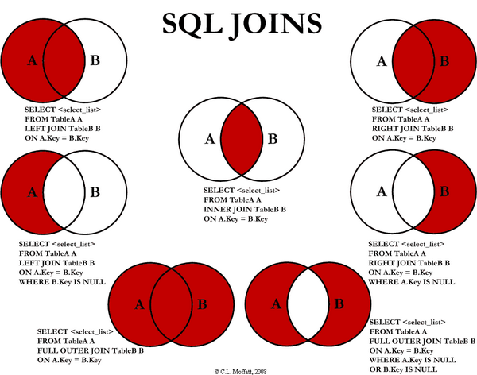

# DB XML

*last modified: 2026-03-05T06:38:02.000Z*

DB XML

영속성 컨텍스트(Persistence Context)**:

애플리케이션과 DB 사이에서 Entity를 저장하고 관리하는 논리적인 메모리 영역

Native Query : Raw Query, 직접 짜는 썡 쿼리

COALESCE()

| **개념** | **설명** | **비고** |
| --- | --- | --- |
| **무결성  Integrity** | 데이터가 전 생애주기 동안  **정확성, 일관성, 유효성**을 유지하는 것 | PK, FK, NOT NULL 등 제약조건으로 강제함 |
| **정합성  Consistency** | 서로 다른 위치의 데이터가  **서로 모순 없이 일치**하는 상태 | 잔액 테이블과 거래 내역 테이블의  합계가 일치함. |
| **의존도  Dependency** | 한 모듈이나 객체가 다른 모듈에  얼마나 의존하는지의 정도 | 높을수록 수정 시 영향 범위가 커짐 |
| **결합도  Coupling** | 모듈 간의 연결 강도 | 낮을수록 유지보수가 유리함 |

**MyBatis `<selectKey>`**

• **목적:** `INSERT` 문 실행 시 DB에서 **자동으로 생성된 키 값(ID)**을

자바 파라미터 객체에 다시 주입(Inject)하여 후속 로직에 사용하기 위함.

• **주요 속성:**

• `keyProperty`: 키 값을 저장할 파라미터 객체의 필드 이름. (예: `boardSn`)

• `resultType`: 키 값의 자료형. (예: `int`, `long`)

• `order`: 키 값을 조회하는 시점. (`BEFORE` 또는 `AFTER`)

• **작동 방식 및 DB별 예시:**

1. **MySQL (`AUTO_INCREMENT`)**:

• `order="AFTER"` 사용.

• `INSERT` **후**에 키 값을 조회하는 함수 (`SELECT LAST_INSERT_ID()`)를 사용

• `INSERT` 쿼리에서 ID 컬럼을 생략하면 DB가 자동 채움

2. **Oracle/Tibero (`Sequence`)**:

• `order="BEFORE"` 사용

• `INSERT` **전**에 키 값을 조회하는 시퀀스 함수 (`SELECT SEQ_NAME.NEXTVAL FROM DUAL`)를 사용

• 가져온 ID 값(`#{keyProperty}`)을 `INSERT` 쿼리 본문에 직접 사용해야함

• **사용 범위:** 기술적으로는 모든 CRUD 태그에 쓸 수 있으나,

새로운 키 생성이 필요한 `<insert>` 문에서만 유용함

• **효과:** `insert(vo)` 호출 후, `vo.get(KeyProperty)`를 통해 **즉시 생성된 ID**를 얻을 수 있어

비즈니스 로직 연계(예: 파일 매핑, 로그 기록)가 수월해진다.

DB Link

- 다른 데이터베이스에 접속할 수 있는 링크

- "FROM 테이블명@DB링크" 형식

- 다른 DB에 특정 유저에 대한 링크를 만들어 해당 스키마에 테이블들을 접근하는 기술

-- DB 링크 생성 (원격 DB의 USER_DEV 계정으로 연결)

CREATE DATABASE LINK DEV_LINK

CONNECT TO USER_DEV

IDENTIFIED BY dev_password123 USING '10.1.1.1:1111/dev_service';

-- 생성 확인 SELECT * FROM ALL_DB_LINKS;

-- 사용 예시 (원격 DB의 MEMBER_INFO 테이블 조회)

SELECT * FROM MEMBER_INFO@DEV_LINK WHERE REG_DATE >= SYSDATE - 7;

NVL(pay, '0') IN ('0') : null도 포함

NVL(pay, '0') ='0' : null은 안돼

Null은 'is'를 사용해서 비교해야하기 때문에 IN에 넣어봤자다

COUNT(NAME) null값 미포함

COUNT(*) null값 포함

regexp_substr('01,02,03,','[^,]+', level)

공통코드 목록을 체크박스로 확인할 때 주로 씀

TRUNC 소수점 절사 및 날짜의 시간을 절사

COUNT(*)는 모든 행의 갯수를 세지만

COUNT(name)은 name에 null이 존재할 경우 세지 않는다

XSS

SQL injection와 함께 가장 기초적 취약점 공격 방법

입력값을 스크립트 함수의 일부분처럼 적어 실행한다

Mybatis에서 xml 파일의 Return 타입

resultType="int" : 쿼리 작동 후 업데이트된 행의 개수 반환, -1은 실패

Delete의 경우 별도의 resultType 업데이트된 행의 개수 반환, -1은 실패

| **MyBatis 태그** | **Java 메서드 반환 타입** | **반환 값의 의미** | **실무 적용 시 주의점** |
| --- | --- | --- | --- |
| **<insert>** | int | **새로 삽입된 행의 개수 (1)** | **useGeneratedKeys** 속성을 사용하면 삽입 후  생성된 PK 값을 VO 객체에 담을 수 있어. |
| **<update>** | int | **조건에 따라 업데이트된 행의 개수** | 업데이트 대상이 없으면 0이 반환 |
| **<delete>** | int | **조건에 따라 삭제된 행의 개수** | 삭제 대상이 없으면 0이 반환 |
| **<select>** | VO, List<VO>, Map, String 등 | 쿼리 결과에 따라 지정된 타입의 객체 또는 목록. | **resultType** 또는 resultMap을 필수로 지정해야 해. |

CROSS JOIN: 두 테이블 사이의 모든 가능한 조합을 생성하는 조인 유형.

ON 절이나 WHERE 절 없이 단순히 두 개의 테이블을 하며,

첫 번째 테이블의 각 행은 두 번째 테이블의 모든 행과 결합된다.

따라서 CROSS JOIN 결과는 첫 번째 테이블의 행 수와 두 번째 테이블의 행 수를 곱한 것과 같다.

Sequence 일련번호 생성 기능 ex)다른 테이블에 같은 일련번호 공유

Synonym 별명 생성 기능

Simple view 하나의 테이블을 참조하는 뷰

Complex view : 여러 개의 테이블을 한번에 참조하는 뷰

Inline View : From절 안에서 사용된 서브쿼리, 캐시처럼 이용

Scalar subQuery : 하나의 행만 결과로 뱉은 서브쿼리

TRUNCATE : 테이블,인덱스의 데이터를 전부 삭제하고 공간을 반납(테이블은 남는다)

explain : 쿼리성능확인

Merge : insert와 update 동시 작동. 문제가 많음

Union 합, Intersect 교, minus 차

Ctas : CREATE TABLE AS SELECT

Transaction: 커밋과 롤백, (원자성, 일관성, 고립성, 지속성)

Mybatis

#{},

${} SQL injection에 취약

preparedStatement 방식인 #{} 은 쿼리의 재사용이 가능

Statement 방식인 ${} 은 재사용이 불가능, 새 쿼리로 인식해서 성능상 차이 있음

<![CDATA[ 안에..]}> 전체 감싸기

LEFT JOIN parking_control.PARK_CNTRL_REGLT_INFO P

on "T.dtm=P.reglt_dtm AND P.apt_idx = 1"

LEFT JOIN에 조건 넣기.

Full outer join (전체 외부 조인) : 두 테이블의 모든 행을 합친다.

매칭되는 데이터는 결합, 그 외는 null로 체움

Ex)

Self join (inner , left) : 동일 테이블을 서로 다른 별칭을 주고 연결

Ex) 회원 중 연관관계를 찾을 떄.

Cross join... : 두 테이블의 모든 행을 조합

Ex)상품 옵션 조합 만들기, 모든 시간대에 모든 서비스상태를 강제로 매핑해야할때

OCR

в ГНОМ ТМА А '.нк-г тлыев в ОХ в.кеу в SEI.ECT FROM А SQL JOINS в SELEc-r ГНОМ тмеАА 'N.NER таыев В ОХ А.кеу в.ксу в FROM А мс.нт таькв в ОХ хкеу ; в„ксу ГНОМ А r„EFT J01N Т„ысв В 1ИСНТ JOIN Т„Ыев В оо ОХ ; ох кк„у в,кеу МЛХ *'HERE А„ке, Ы.ЛЛ. SELECT гао.м А жОМ таЬ[еА А ПЛ.“ 0UTER J0[N таькв В vv.'LL 0UTEk тамев В А. Кеу : ю Кеу ОХ А, кеу в,кеу •x'HHRE ОН в_Ксу IS

WITH RECURSIVE 재귀 쿼리==========================

WITH RECURSIVE cte_count

AS (

-- Non-Recursive 문장( 첫번째 루프에서만 실행됨 )

SELECT 1 AS n

UNION ALL

-- Recursive 문장(읽어 올 때마다 행의 위치가 기억되어 다음번 읽어 올 때 다음 행으로 이동함)

SELECT n + 1 AS num

FROM cte_count

WHERE n < 3

)

1.메모리 상에 가상의 테이블을 저장한다.

2.반드시 UNION 사용해야한다.

3. 반드시 비반복문(Non-Recursive)도 최소한 1개 요구된다. 처음 한번만 실행

4.SubQuery에서 바깥의 가상의 테이블을 참조하는 문장(반복문)이 반드시 필요하다.

5.반복되는 문장은 반드시 정지조건(Termination condition)이 요구된다.

6.가상의 테이블을 구성하면서 그 자신(가상의 테이블)을 참조하여 값을 결정할 때 유용한다.

3가지 쓰임새

| **쓰임새** | **핵심 목적** | **앵커** | **재귀 멤버** | **종료 조건 예시** |
| --- | --- | --- | --- | --- |
| **1. 시퀀스 생성** | 테이블 없이 연속된 데이터 생성 | 시작 값 (예: 1 또는 현재 날짜) | N+1 또는 Date + 1 day | N < Max_Count |
| **2. 계층 구조 탐색** | 부모-자식 관계 전체 조회 | 최상위 부모 노드 (Root) | T1.ID = T2.Parent_ID 조인 | 자식 노드가 더 이상 없을 때 (암묵적) |
| **3. 경로 추적/제약** | 복잡한 네트워크 탐색 및 검증 | 출발 노드 | T1.End_Node = T2.Start_Node 조인 | path_string에 순환 노드가 포함되었을 때 |

============================================================

CONNECT BY

SELECT

FNC_IDX,

PRNT_FNC_CD,

FNC_NM,

LEVEL AS LVL -- LEVEL이라는 내장 함수로 깊이(LVL)를 바로 얻을 수 있다.

FROM

TB_FNC_INFO

START WITH

PRNT_FNC_CD IS NULL -- 시작점: 부모가 없는 최상위 노드 (ROOT)

CONNECT BY

PRIOR FNC_IDX = PRNT_FNC_CD;

-- 연결 조건: 이전 행(PRIOR)의 ID(FNC_IDX)가 현재 행의 부모 ID(PRNT_FNC_CD)와 같다

Proceduere 읽기

===========================================================

데이터베이스 동시성 제어 …

Lock

:트랜잭션(사용자)이 동시에 동일한 데이터에 접근하여 데이터를 수정할 때,

데이터의 일관성과 무결성을 깨뜨리는 것을 방지하기 위해 사용되는 메커니즘

Granularity 그래녈레러티

:락의 범위. 락은 적용되는 범위에 따라 **테이블 전체**에 걸릴 수도 있고,

특정 **페이지/블록**, 특정 Row에만 걸릴 수도 있다

Deadlock 교착상태

쿼리 사용 중 Lock 걸리는 경우

**1.DML 작업 충돌**

2.DeadLock 서로에게 제한

3.테이블/스키마 변경

4.SELECT FOR UPDATE

5.트랜잭션 격리 수준에 따른 락 (읽기 중 충돌)

-- 락 정보 조회

SELECT

L1.SID AS holding_sid, -- 락을 걸고 있는 세션 ID

S1.USERNAME AS holding_user,

L2.SID AS waiting_sid, -- 락을 기다리는 세션 ID

S2.USERNAME AS waiting_user,

O.OBJECT_NAME -- 락이 걸린 테이블/객체 이름

FROM

V$LOCK L1, V$LOCK L2, V$SESSION S1, V$SESSION S2, ALL_OBJECTS O

WHERE

L1.BLOCK = 1 AND L2.REQUEST > 0

AND L1.ID1 = L2.ID1 AND L1.ID2 = L2.ID2

AND L1.SID = S1.SID

AND L2.SID = S2.SID

AND L1.ID1 = O.OBJECT_ID -- 락이 걸린 객체 ID를 테이블 이름과 연결

ORDER BY

L1.SID, L2.SID;

-- 락의 원인이 된 $\text{SQL}$ 조회

SELECT SQL_TEXT

FROM V$SQLTEXT

WHERE SID = [holding_sid 값] -- 락을 걸고 있는 세션 ID 입력

ORDER BY PIECE;

-- 느린 SQL 찾기

SELECT

A.SQL_ID,

A.EXECUTIONS, -- 실행 횟수

A.ELAPSED_TIME / A.EXECUTIONS AS avg_time_ms, -- 평균 소요 시간 (밀리초)

B.SQL_TEXT

FROM

V$SQL A, V$SQLTEXT B

WHERE

A.SQL_ID = B.SQL_ID

AND A.EXECUTIONS > 0 -- 실행된 쿼리만

ORDER BY

avg_time_ms DESC; -- 평균 시간이 오래 걸리는 쿼리 순서대로 정렬

-- 특정 테이블에 걸려있는 모든 인덱스 목록 및 컬럼 확인

SELECT

T.INDEX_NAME,

I.COLUMN_NAME,

I.COLUMN_POSITION

FROM

ALL_INDEXES T,

ALL_IND_COLUMNS I

WHERE

T.OWNER = '사용자스키마명'

AND T.TABLE_NAME = '테이블명'

AND T.INDEX_NAME = I.INDEX_NAME

ORDER BY

T.INDEX_NAME, I.COLUMN_POSITION;

-- 현재 활성 세션 확인

SELECT

SID,

USERNAME,

STATUS, -- ACTIVE (작업 중)인지 INACTIVE (대기 중)인지

CLIENT_PROGRAM_ID, -- 어떤 프로그램 (DBeaver 등)으로 접속했는지

SQL_ID -- 현재 실행 중인 쿼리의 ID

FROM

V$SESSION

WHERE

USERNAME IS NOT NULL

ORDER BY

LAST_CALL_ET DESC; -- 마지막 작업 이후 경과 시간

===========================================================

PARTITION BY 분석함수

WINDOW FRAME

| **CURRENT ROW** | 현재 계산 중인 행 | 기준점 |  |
| --- | --- | --- | --- |
| **PRECEDING** | 현재 행보다 **앞선** 행 | 과거 / 이전 | 2 PRECEDING : 현재 행 바로 앞의 2개 행 |
| **FOLLOWING** | 현재 행보다 **뒤따르는** 행 | 미래 / 이후 | 1 FOLLOWING :현재 행 바로 뒤의 1개 행 |

**UNBOUNDED PRECEDING : 파티션의 시작점**

**UNBOUNDED FOLLOWING :파티션의 끝점**

**FOLLOWING : 현재 행 뒤에 오는 행**

ROWS BETWEEN UNBOUNDED PRECEDING AND CURRENT ROW

파티션이 시작된 시점부터 **현재 행까지**의 누적 합계/누적 개수 계산.

ROWS BETWEEN CURRENT ROW AND 1 FOLLOWING

:현재 행과 바로 다음 행만 포함하여 계산 (전방 예측).

ROWS BETWEEN 1 PRECEDING AND CURRENT ROW

:현재 행과 바로 이전 행만 포함하여 계산 (후방 포함).

ROWS BETWEEN CURRENT ROW AND UNBOUNDED FOLLOWING

:현재 행부터 **파티션의 끝까지**의 값 계산 (예: 앞으로 남은 재고 예측).

SQL 튜닝 - 실행 계획 분석

1. Explain for 명령어
1. Index , 복합 index 등의 처리
복합 index는 왼쪽 컬럼부터 차례대로 적용해야만 유효

1. join 순서
작은 테이블부터 join

1. 불필요서브쿼리, Temp 테이블
1. count, sum 집계쿼리
1. distinct, order by 최소화
1. ANALYZE 통계 최신화
1. limit, rownum, fetch first 등 개수 제한
1. hint, optimizer 판단 근거를 제공
EXPLAIN FOR 의 PLAN_TABLE

OPERATION* : 

Nested loop(s) : 두 테이블을 조인할 때, Outer Table 의 행을 하나씩 읽으면서

Inner Table에서 일치하는 행을 반복적으로 찾는 방식.

Outer Table 의 행 수가 매우 적고 안쪽 테이블에 적절한 인덱스가 있을 때만 효율적

TABLE ACCESS FULL 가장 나쁨, 인덱스 없는 케이스

INDEX FULL SCAN (비효율) : **전체 인덱스** 쓰되 처음부터 끝까지 모두 읽을 때

*'인덱스 컬럼으로 정렬'**을 하되, 범위(RANGE)를 지정할 수 없어서 **인덱스 전체**를 읽는 것

where절을 안쓰거나 index 선행컬럼규칙 위반

INDEX RANGE SCAN (일반적) : WHERE 조건에 맞는 **특정 범위**의 데이터만 찾을 때

INDEX UNIQUE SCAN (최적) : PK나 UNIQUE 키로 **1건의 행**을 찾을 때.

TABLE ACCESS BY INDEX ROWID 최소,필수

COST : 말그대로 비용. I/O 부하와 CPU 사용령 등을 계산한 추정치.

수치가 높을 수록 좋지않다

DATA DICTIONARY (SYSTEM VIEW)

V$LOCK, V$SESSION

{

기본키 (Primary Key) <-선택여부-> 대체키 (Alternate key)

데이터베이스 테이블 내의 각 레코드(행)를 고유하게 식별하는 역할

중복값 불가, NULL 값 불가

외래키 (Foreign Key):

다른 테이블의 기본키와 관련된 키로, 두 테이블 간의 관계를 설정하는 데 사용

주로 관계형 데이터베이스에서 사용되며, 다른 테이블과의 연결을 구현

다른 테이블의 기본키와 동일한 값 불가, NULL 값 불가

슈퍼키 (Super Key) : 유일성 O, 최소성 X

유일성의 특성을 만족하는 속성 또는 속성들의 집합

한 릴레이션의 속성들의 집합으로 구성된 키

릴레이션에 있는 모든 튜플에 대해 유일성을 만족시킨다.

(아이디) : 각 튜플을 구분할 수 있음 --> 유일성O, 최소성O

(나이, 직업, 등급) : 다른 튜플과 충분히 중복될 수 있음 --> 유일성X, 최소성X

(아이디, 나이, 직업, 등급) : 각 튜플을 구분할 수 있음 --> 유일성O, 최소성X

후보키 (Candidate Key): 유일성 O, 최소성 O

특정 레코드를 식별할 수 있는 유일 키

기본키로 사용될 수 있는 가능성이 있는 키

복합키 (Composite Key):

복합키는 두 개 이상의 컬럼을 결합하여 기본키로 사용되는 키입니다.

복합키를 구성하는 모든 컬럼의 조합이 고유한 값을 가져야 합니다.

Ex)주문 테이블: 주문 번호와 상품 번호 조합

}

DB 검증

1. 비교 대상을 명확하게 정한다,
As-is 운영서버와 to-be 개발서버의 데이터가 일치하는지

1. With문 등으로 해당 쿼리의 전제조건인 rawData의 데이터 확인
갯수가 맞는지, 컬럼값이 이상한지 등등

3. rawData에 해당되는 테이블이 일치한다면

쿼리값이 일치하는지 확인

