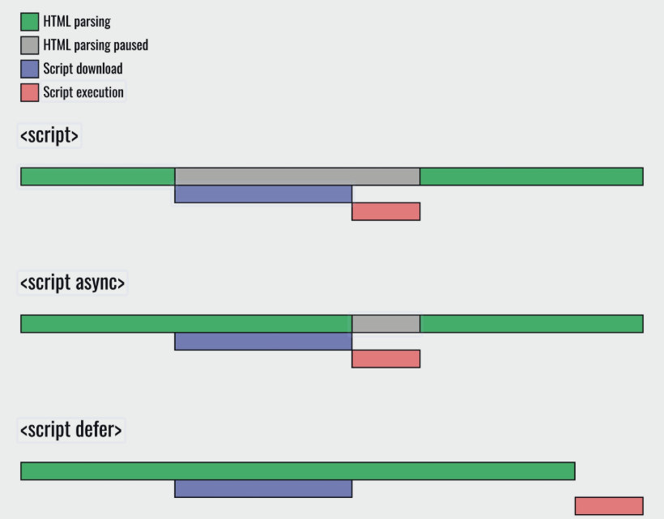

# JSP

*last modified: 2026-05-31T08:51:02.000Z*

JSP

export: 이 키워드는 해당 함수가 모듈의 공개 API로 내보내짐을 의미.

이 함수는 다른 모듈에서 import 문으로 불러옴이 가능해짐

ex) import m from './math.js';

async: 이 키워드는 함수가 비동기적으로 실행된다 (<->Synchronous )

await 를 사용하여 비동기 작업이 완료될 때까지 기다리는 것이 가능

Http 요청의 3가지 구성요소

시작 줄: method (GET, POST 등)

요청 대상 URL (.do)

HTTP 버전 (통신규약)

Headers: 요청에 대한 메타 정보

Host 통신대상 서버

Content-Type 본문의 데이터 형식

Content-Length

User-Agent 요청을 보낸 브라우저,OS 등 클라이언트 정보

Body : 서버에게 보내려는 데이터(페이로드)가 담김 (AJAX 호출 시의 "data:"를 포함)

JS 코드 실행 단계

1.선언 단계(Declaration phase)

변수 객체를 생성하고 변수를 등록한다.

스코프는 해당 변수 객체를 참조한다.

2.초기화 단계(Initialization phase)

변수 객체에 등록된 변수를 메모리에 할당한다.

변수는 undefined로 초기화된다.

3.할당 단계(Assignment phase)

undefined로 초기화된 변수에 실제값을 할당한다.

캡슐화되어있어도 window.a=a; 이런식으로 선언하면 a() 사용가능

Jstl 못찾는 오류 - javax(Java EE 8 API 이하) - > jakarta (Java EE 9 API 이상)

템플릿 엔진 - SiteMesh,

${} : JSP(Java Server Pages)에서 사용하는 Expression Language (EL)의 문법

NaN, Not a Number : 숫자가 아닌 값

Ex)'X'/3, Number('X')

Null : 값이 존재하지 않음을 나타내는 값

변수를 초기화하지 않거나, 어떤 값이 없는 상황을 나타내기 위해 사용

Undefined : 변수나 속성이 정의되어 있지 않은 경우를 나타내는 값

값이 할당되지 않은 변수나 객체의 속성에 접근하면 undefined

Null : 값이 없음을 의도적으로 나타내는 반면,

Undefined : 값이 할당되지 않은 상태를 나타내기 때문에 의도하지 않은 상황에서 발생

<jsp:include page="b.jsp" flush="true"/>

1. 요청시간에 처리

2. 별도의 파일로 요청 처리 흐름을 이동

3. 화면 레이아웃의 일부분을 모듈화 할 때 주로 사용된다.

<%@ include %>

1. JSP파일을 자바 소스로 변환할 때 처리

2. 현재 파일에 삽입시킴

연결된 파일을 포함해서 같이 컴파일 한다.

jstl c 태그

c:if - 특정 조건에 따라 HTML 코드를 출력하거나 숨김

c:forEach - 컬렉션(Array, List, Map)을 반복하여 HTML 코드를 출력

c:choose, c:when, c:otherwise - if-else 구문과 유사한 기능을 하는 태그

c:set - 변수에 값을 설정하거나 변경

c:out - 변수의 값을 화면에 출력

c:import - 다른 URL의 내용을 현재 JSP에 가져오는 기능을 함

c:url - URL을 생성하거나 조작하는 기능을 함

<a href=\"/ejgTestNotice?no=\"/>

"double quotation marks"가 들어가는 부분에 필요한 "\"

URL에 #noSwiperRefresh Fragment 추가

-Swiper.js 라이브러리가 이 Fragment가 있는 페이지는

슬라이드 갱신을 하지 않도록 처리. 새로고침없이 Ajax 요청을 처리가능

===============================================

클로저(Closure)

window.myExposedVar = "Hello"; //화면 어디서든 접근 가능?

function createCounter() {

let count = 0; // 이 변수는 createCounter 스코프 내부에 갇혀 있음 (지역 변수)

return function increment() {

count++; // 내부 함수(클로저)는 count에 접근 가능

return count;

};

}

const counter = createCounter();

// count 변수에 직접 접근은 불가하지만,

// counter() 함수를 통해 간접적으로 접근 및 수정 가능

console.log(counter()); // 1

console.log(counter()); // 2

==========================================

Apply

Math.min(a,b,c,d ) 이런식으로 변수를 추가해야하지만

Math.min.apply(this,args) args안의 배열들 내의 값들을 변수로 좌르륵

=Math.min(…args)

Call 인수 나열 방식

전개구문 ...

[https://developer.mozilla.org/ko/docs/Web/JavaScript/Reference/Operators/Spread_syntax](https://developer.mozilla.org/ko/docs/Web/JavaScript/Reference/Operators/Spread_syntax)

드림코딩 유튜브 정리

======================================

Chrome Just-in-time 으로인해 모두가 단합해 표준안을 만들어

EcmaScript 라는 것을 만듬

ECMA Script 5, 6에서 중요한 부분이 만들어짐

SPA (Single Page Application)

부분적 업데이트하는 page 유행 -> Angular, React, Vue

Node 의 등장 - mobile, desktop 개발이 가능해짐

WA(Web assembly)

======================================================

'Use strict'; - 빡세게 문법 체크

API 확인용 사이트

Ecma-international.org -원본사이트

Developer.mozilla.org - 강추

Html의 과정

1.Parsing Html -> 브라우저가 Html 파일을 위에서부터 읽어

 DOM 트리 생성. 그러나 fetching js중에는 일시중단

2.blocked

fetching js - js파일 다운로드, 다운로드

executing js - 다운로드 완료 후 js 실행

blocked 부분을 처리하는 방법 3가지

OCR

口 HTML parsing 口 HTML parsing paused 口 Script download 口 Script execution 

1. 제일 비효율적임. 기다리는 시간이 길다
1. Asyn (boolean 속성) ex) 
selector 등으로 dom 요소를 조작하려한다면 문제가 있음

js의 의존성(순서, 요소 등)에 의해 문제가 생김

3. defer : executing을 html 파싱 끝난 후 함

executing을 가장 마지막에 하는 방식으로 가장 안정적이고 빠름

어떤 변수나 함수에 접근할 수 있는지를 결정

1.전역 스코프 (Global scope)

2.지역 스코프

-함수 스코프

-블록 스코프 (괄호로 묶인 코드 블럭)

변수선언 키워드

|  |  | Mutalbe | 중복선언 | hoisting | 비고 |
| --- | --- | --- | --- | --- | --- |
| var | 초기 | O | O | O | 블록 무시 |
| let | ES6 (2015년) | O | X | X | 일반적인 변수 선언에 사용되며, 유효 범위가 명확하다. |
| const | ES6 (2015년) | X | X | X | 선언과 동시에 값을 할당해야 하며, 상수에 사용된다. |
| number |  |  |  |  | TS - let a : number = 1.2; |

원시타입

| **타입** | **설명** | **예시** |
| --- | --- | --- |
| **Number** | 정수와 부동 소수점 숫자를 포함하는 유일한 타입. | let num = 10;  const pi = 3.14; |
| **String** | 텍스트 데이터를 나타내며 따옴표로 묶어 표현. | let name = "개발자";  const msg = '안녕'; |
| **Boolean** | 논리적인 참/거짓을 나타내는 타입. | const isTrue = true;  let done = false; |
| **Undefined** | 변수가 선언되었지만 **아직 값이 할당되지 않은** 상태. | let value;  (변수 선언만 하고 초기화하지 않은 경우) |
| **Null** | 변수에 **의도적으로 값이 없음**을 나타내기 위해 할당한 값. | let item = null; |
| **Symbol** (ES6) | 유일하고 불변한 값으로, 주로 객체 속성 키로 사용되어 충돌을 방지함. | const key = Symbol('id');  getOwnPropertySymbols로 조회 |
| **BigInt** (ES2020) | 안정적으로 표현할 수 있는 최대 정수($2^{53}-1$)보다 큰 정수를 나타낼 때 사용. 끝에 n을 붙임. | const big = 9007199254740991n; |

Infinity, -infinity(negativeInfinity), NaN(Not a number)

| **타입** | **설명** | **예시** |
| --- | --- | --- |
| **Object** | JS의 가장 기본적인 복합 데이터 타입. 키(Key)와 값(Value)의 쌍으로 이루어진 속성들의 집합. | const person = { name: "홍길동", age: 30 }; |
| **Array** | 여러 값을 순서대로 담는 객체. (내부적으로 Object의 특성을 가짐) | const arr = [1, 2, 'three']; |
| **Function** | 호출 가능한 코드 블록. (JS에서 함수도 일종의 객체임) | function hello() { /* ... */ } |
| **기타** | Date, RegExp, Map, Set 등 빌트인 객체들. |  |

Dynamic typing - TS의 원인중 하나

선언된 변수의 값이 바뀔때, 원시타입이 동적으로 변화

let text = 'hello';

console.log(text.charAt(0));

text = 1;

text = '7' + 5;

text = '8' / '2';

console.log(text.charAt(0));

================================

operatior 종류

+,-,*,/

++,--

=,<,>

||, &&, ! (or, and, not)

or 연산자 : 맨 앞의 계산이 완료되면 후의 연산은 종료됨

&& 연산자: 맨 앞의 계산이 완료되면 후의 연산은 종료됨

== : 다른 타입이어도 같다면 true

===: 같은 타입인지도 확인

const ejg = { name : "은재관"};

const ejg2 = { name : "은재관"};

const ejg3 = ejg;

console.log(ejg==ejg2);

console.log(ejg===ejg2);

console.log(ejg===ejg3);

console.log(0 == false);

console.log(0 === false);

console.log('' == false);

console.log('' === false);

console.log(null == undefined);

console.log(null === undefined);

Truthy :

falsy :

… rest parameter

function declaration : 변수가 hoist됨

function expression : **선언된 라인 이후에만** 호출 가능.

anonymous function :

Arrow function : **선언된 라인 이후에만** 호출 가능.

IIFE (Immediately Invoked Function Expression)

: (function () { } internalLogic(); // 내부에서만 호출 가능 })();

Document.ready = ()function(){}();

실행컨텍스트 식별자를 효율적으로 결정

스코프체인 - 내부에 없는 변수를 외부환경으로 하나씩 찾아보는 현상

Callback

Promise then

computed properties

object.property - 확실하게 값을 알 경우

object['property'] - 속성값을 받아서 쓸 경우

property value shorthand

constructor function

in operator - console.log('name' in Person);

for ..in 와 for ..of 와 forEach

for (key in Person),

for (value of array)

fruits. forEach( function (fruit, index, array){

console.log(fruit, index);

} );

fruits. forEach( (fruit, index, array)=> console.log(fruit, index));

cloning

const user2 = user; user2의 reference를 user로 지정

object.assign (dest, [obj1, obj2, obj3 ...])

:모든 object를 섞되 뒤에 나온 변수로 덮어 씌운다

---배열 명령어---------

fruit.push('사과','딸기'); --뒤에 넣기

fruit.pop(); --뒤에서 뺴기

＃shift는 상당히 느림

fruit.unshift(); --앞에 넣기

fruit.shift(); -- 앞에서 빼기

fruit.splice(1,4); -- 배열 잘라서 없애기 (1부터 4개 삭제)

fruit.splice(1,4,'수박','포도'); -- 1부터 4개 삭제 후, 그자리에 수박,포도 삽입

fruits = fruits.concat(fruits2); -- 2개의 배열 합치기

fruits.IndexOf('사과') --가장 첫번째 사과 위치 찾기 (없으면 -1)

fruits.lastIndexOf('사과') --뒤에서 첫번째 사과 위치 찾기 (없으면 -1)

fruits.includes('사과') --사과 포함에 대한 boolean

fruits.push()

-----------------------------

JSTL

escapeXml : 태그로 인식할 수 있는 값을 문자열로 변환 XSS방지

C:url 태그 : jstl의 특징으로 url을 서버에서 가져올 수 있음

쿠키 사용 불가 시 자동으로 URL Rewriting 처리

웹서버 렌더링 - jstl , <%%> , <@page %>

| **기술** | **종류** | **동작 방식** | **주요 사용 목적** |
| --- | --- | --- | --- |
| **<c:import>** (JSTL) | **포함 (Include)** | 요청 시점에 **외부 자원(다른 서버의 URL, 파일, JSP 등)**을 가져와 현재 페이지에 합쳐서 실행. | 외부 리소스를 포함하거나, 재사용 가능한 템플릿 삽입. **외부 URL**이나 로컬 파일의 실행 결과를 가져와 합치기 |
| **<jsp:include page="..." />** (JSP 액션 태그) | **동적 포함 (Dynamic Include)** | 요청 시점에 포함될 페이지를 별도로 **실행**한 후 그 결과만 가져와 합침. | 동적으로 변하는 콘텐츠 포함.  실행 결과 합치기 (런타임 시), **동적 컨텐츠에 최적** |
| **<jsp:forward page="..." />** (JSP 액션 태그) | **이동 (Forward)** | 현재까지의 처리 내용을 **유지한 채** 클라이언트의 요청 처리를 **다른 페이지로 완전히 이관**함. | 브라우저 주소창은 **최초 요청 URL**을 그대로 유지.  작업 위임, Controller 역할 분리. |
| **response.sendRedirect("...")** (Java) | **재요청 (Redirect)** | 서버가 클라이언트에게 **새로운 URL로 다시 요청하라**는 명령을 내려 클라이언트가 완전히 새로운 요청을 보냄. | 로그인 후 메인 페이지 이동, URL 변경. |
| **<%@ include file="..." %>** (JSP 지시어) | **정적 포함 (Static Include)** | JSP 파일이 **서블릿으로 변환될 때(컴파일)**, 두 파일의 코드를 물리적으로 합침. | 변경이 거의 없는  헤더/푸터 등 재사용. |

| **기술** | **언제 사용하는가?** | **사용 예시 (너의 개발 환경)** |
| --- | --- | --- |
| **<jsp:include page="..." />** (동적) | **메인 페이지 내 특정 영역만 동적으로 변할 때.** | 템플릿 페이지(main.jsp)가 있고, **사용자 권한에 따라 보여줘야 하는 위젯(Widget)이나 메뉴**가 달라질 때. **별도의 서블릿을 실행**해서 결과를 가져와 합침. |
| **<c:import url="..." />** | **로컬 파일이 아닌, 외부 시스템/URL의 결과를 가져와 보여줄 때.** | 우리 서버가 아닌 **공공 데이터 포털 API 결과(XML/JSON)**를 받아와서 JSP에서 파싱 후 HTML로 변환해 보여주거나, **다른 도메인의 템플릿**을 끌어와야 할 때. |

const generator = generatorFunction();

console.log(generator.next()); // 출력: { value: 1, done: false }

console.log(generator.next()); // 출력: { value: 2, done: false }

console.log(generator.next()); // 출력: { value: 3, done: true }

==============라이브러리=============

VerbalExpressions/ JSVerbalExpressions - 정규표현식 관련

Name 속성 : form 등으로 http 전송용

title 속성: 제목 또는 설명을 제공하는 역할 , 음성 서비스 시 사용

브라우저 탭에 표시되는 문서 제목, 이미지나 링크 위에 마우스 커서를 올렸을 때

툴팁으로 표시되는 설명.

Padding : 대상 내부로의 간격

Margin : 대상 외부로의 간격

Yield

Generator 함수 내에서 사용되며, 함수 실행을 중지하고 값을 반환하는데 사용

Function*과 함께 사용

function* generatorFunction() {

yield 1;

yield 2;

return 3;

}

