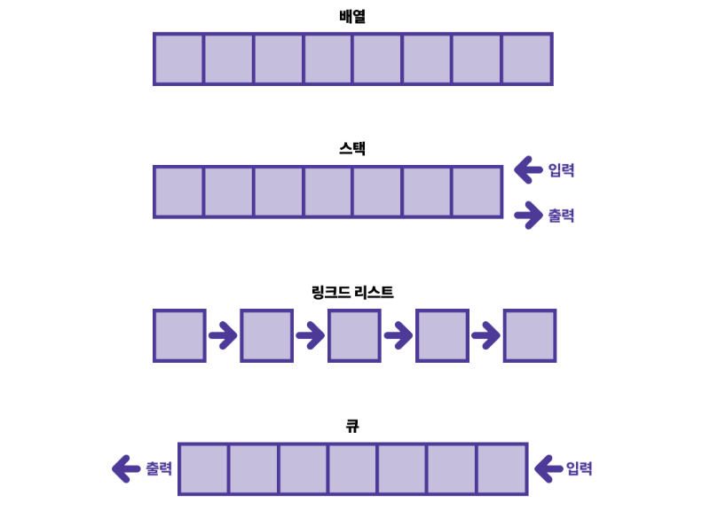

# 방법론

*last modified: 2026-03-20T14:09:03.000Z*

- **요구사항 분석(Requirements)**
  - “무엇을 만들지?” 정의
- **설계(Design)**
  - 시스템 구조, UI, 데이터 설계 등
- **구현(Implementation / Coding)**
  - 실제 코드 작성
- **테스트(Testing / Verification)**
  - 버그 수정, 기능 검증
- **배포/유지보수(Deployment / Maintenance)**
  - 사용자에게 제공, 업데이트
Cut-Over: 프로젝트 수행 중에 개발환경에서 실제 운영환경으로 전환하는 단계

| **방법론** | **단계 순서** | **반복/건너뛰기 특징** | **느낌** |
| --- | --- | --- | --- |
| **폭포수(Waterfall)** | 1 → 2 → 3 → 4 → 5 | 반복 없음  한 단계 끝나야 다음 단계 | ‘한 번에 쭉’ |
| **V-모델** | 폭포수 + 테스트 단계 매칭 | 반복 없음  설계 단계별 대응 테스트 | 설계 중심 품질 |
| **나선형(Spiral)** | 1→2→3→4 반복 | **반복적**, 위험 관리 중심 | 점점 개선 |
| **프로토타이핑** | 1→3→4 반복 (설계 생략 가능) | **반복적**, 설계 없이 구현 먼저 | ‘돌려보면서 만든다’ |
| **RAD** | 1→3→4 반복, 2(설계)는 최소화 | 반복적, 빠른 개발 중심 | 프로토타입+빠른 피드백 |
| **애자일  (Scrum, XP)** | 1→2→3→4 반복, 짧은 주기 | 단계 간 유연,  설계/코딩/테스트 혼합 | 지속적 개선 |
| **Ad-hoc /  카우보이 코딩** | 3→4 임의 반복 | 설계/분석 건너뛰기 | 즉흥적, 무계획 |

- **edge case (엣지 케이스)**

→ 시스템이 정상적으로 동작하기 어려운 **극단적인 입력이나 상황**을 의미합니다.

예: 입력값이 0, null, 빈 문자열, 최대값일 때 등.

⇒ “그 오류가 날 만한 케이스”가 *특정 극단적 조건에서만 발생*한다면 **edge case**입니다.
- **corner case (코너 케이스)**

→ edge case와 비슷하지만, **여러 극단 조건이 동시에** 일어나는 상황을 더 강조할 때 사용합니다.

예: 파일이 비어 있으면서 동시에 권한이 없는 경우.
- **failure case (실패 케이스)**

→ 단순히 **오류가 발생하는 경우 자체**를 지칭할 때 사용합니다.

예: “이 함수의 failure case는 입력이 음수일 때다.”
- **error scenario / error condition (오류 시나리오 / 오류 조건)**

→ 좀 더 포멀하거나 문서적인 표현입니다.

예: “이 API의 error scenario는 네트워크 타임아웃이다.”
cross browing : 최대한 많은 종류의 웹 브라우저에서 정상적으로 작동하는 웹페이지를 만드는 방법론

**개발문서**

| **문서명** | **작성 주체** | **개발자 작성** | **문서 목적** |
| --- | --- | --- | --- |
| **상세 설계서(변경분)** | 개발자 | **O** | 구현된 내용을 근거로 한 상세 기술 설명 |
| **단위 테스트 케이스** | 개발자 | **O** | 개발자가 작성한 기능의  테스트 시나리오 명시 |
| **단위 테스트 결과서** | 개발자 | **O** | 실제 테스트 수행 결과 기록. QA/검수용 |
| **연동(API) 명세서(최종본)** | 개발자 | **O (높음)** | 프론트/다른 서비스가 사용할  API 최종 형태 문서화. |
| **DB 변경 내역서(DDL 문서)** | 개발자 or DBA | **O** | 테이블/컬럼/인덱스 등  물리 모델 변경 내역 기록.  배포 DB 반영용. |
| **배포 문서(릴리즈 노트)** | 개발자 or DevOps | **O** | 어떤 기능이 배포됐는지,  어떤 파일/테이블이 변경되는지 요약. |
| **운영 매뉴얼  (운영팀용)** | 개발자 + 운영팀 협업 | **△ (상황따라)** | 운영 중 필요한 설정/기능 설명.  운영팀이 작성하지만  개발자 입력 필요할 수 있음. |
| **장애 대응 가이드(필요 시)** | 운영/QA 중심, 개발자 협조 | **△ (부분 참여)** | 장애 발생 시 대처법,  로그 위치 등 문서화. |
| **기능 검수 요청서** | 개발자 | **O** | QA/기획 검수를 요청할 때 작성.  내부 프로세스 따라 다름. |
| **코드 리뷰 기록  (시스템 자동/협업문서)** | 개발자 | **O (상황따라)** | 사내 규정에 따라 리뷰 흔적을  문서화할 때. |
| **변경 이력 로그(Change Log)** | 개발자 | **O (일부)** | 기능별 변경 포인트 기록.  릴리즈 노트와 연결됨. |
| **테스트 환경 설정 문서** | DevOps 90%,  개발자 10% | **△ (필요 시)** | QA/Dev가 테스트 환경을  재구축할 수 있게 도와주는 문서. |

**개발자가 작성하지 않는 문서**

| **문서명** | **원래 작성 주체** |
| --- | --- |
| **요구사항 정의서** | 기획/BA |
| **기능 정의서** | 기획 |
| **스토리보드/화면 설계서** | UX/기획 |
| **사용자 매뉴얼** | UX/기획/운영 |
| **업무 매뉴얼(실업무 담당자용)** | 업무부서 |
| **엔티티 정의서(논리 모델)** | 모델러/DBA |
| **프로세스/업무 흐름도** | 기획/BA |

**테이블 정의서 (물리)**

발생주기, 최대 예상 저장량, 예상발생량, 관련 엔티티명, 보존기간

테이블 유형

1)일반 테이블

2)파티션 테이블 : 데이터가 많아져서 기간별/범위별로 분리해 저장하는 테이블

3)기타 : Temporary Table,View,code table,history table

엔티티(Entity): 테이블의 설계 원본이 되는 업무 개념 단위

실제 테이블이 만들어지기 전에 기획/모델러가 작성한 업무 객체

탐욕 알고리즘(Greedy Algorithm)

지금 이 순간 당장 최적인 답을 선택하는 알고리즘

매직넘버

룩업테이블

어퍼바운드

DFS 깊이 우선 탐색 (깊게 싹 훑기)

