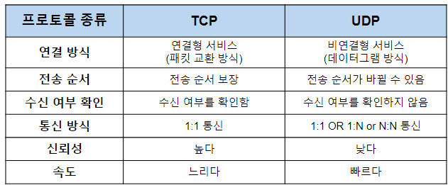
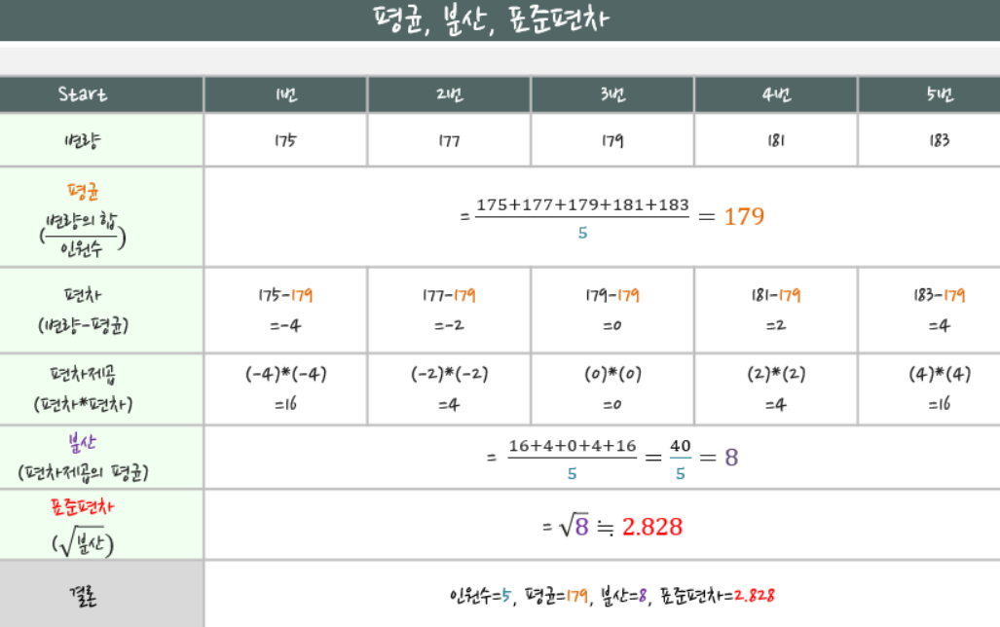

# 소프트웨어 지식

*last modified: 2026-05-31T08:50:48.000Z*

**오버헤드**

실제 데이터 외에 관리 목적으로 추가되는 부가 정보. 피할 수 없는 필수 비용.

**자동 메모리 관리 (LRU)**

메모리가 꽉 찼을 때 뭘 지울지 자동으로 결정하는 방식.

**참조 안전성 (refcount)**

여러 곳에서 같은 데이터를 쓸 때 아직 쓰는 곳이 있는데 지워버리는 사고를 막는 것.

1이상 n이하의 수가 적힌 카드들,

이 카드를 1번째에서 n번째 상자에 랜덤으로 넣는다.

이제 상자그룹을 만드는데 규칙은 이렇다.

1.그룹에 포함되지 않은 상자를 선택,

2.해당 상자안에 적힌 수와 같은 번째의 상자를 선택

ex) 1번째 상자에 8번카드 -> 8번째 상자를 선택

3.다시 그 상자로 2번을 반복하여 사용하지않은 상자가 나올때까지 반복하여 상자그룹 완성

4.다시 1번으로 돌아가 사용하지않은 상자가 없을때 까지 반복

이렇게 나온 상자그룹을 2개 선택해서

그 상자안의 카드 갯수를 곱했을때의 최대값을 구한다

(이 때, 상자그룹이 2개가 되지 못한다면 최대값은 0이 된다.)

Singleton Pattorn

스택(Stack)

후입선출(push, pop and peek), 마치 실린더

큐(Queue)

선입선출(enqueue, dequeue and front) 마치 기차

선형 탐색

말그대로 차례대로 탐색하는 방법으로 가장 기본적인 탐색 알고리즘

최악의 시간 복잡도 O(n)

이진 탐색

"정렬된" 배열에서 특정값을 찾는 효율적인 탐색 알고리즘

중간값을 기준으로 크냐 작냐를 판단해서 반복적으로 해를 찾는다.

시간 복잡도 최대값은 O(log n)

정렬 — O(N log N), Hash Map 조회 — O(1)

중복 제거 / 존재 여부 확인 — O(1)

정렬 — O(N log N)

깊이 우선 탐색(DFS, Depth-First Search):

깊이 우선 탐색은 그래프나 트리를 탐색하는 알고리즘 중 하나로,

가능한 깊숙한 곳까지 탐색한 후 다음 노드 경로를 탐색

스택(Stack)이나 재귀 함수를 사용하여 구현

시간 복잡도 : O(V+E), V : 노드 수, E : 에지 수

ex)미로 찾기, 연결 요소 찾기

너비 우선 탐색(BFS, Breadth-First Search):

너비 우선 탐색은 그래프나 트리를 탐색하는 알고리즘으로,

한 노드에서 인접한 모든 노드를 우선 탐색한 후에 다음 레벨의 노드를 탐색

큐(Queue)를 사용하여 구현됩니다.

최단 경로 찾기, 가중치 없는 그래프의 최단 경로 찾기 등의 문제에 사용됩니다.

직렬화 -객체를 이진 형태로 변환

장점

1)데이터의 보존: 직렬화된 객체는 바이트 형태로 저장되므로, 객체의 필드 값들이 보존.

이를 통해 객체를 나중에 다시 복원하거나 다른 시스템으로 전송할 수 있다.

2)데이터 공유: 직렬화된 객체는 다른 시스템 또는 프로세스 간에 공유할 수 있다.

객체를 직렬화하여 전송하거나 데이터베이스에 저장하여 다른 시스템이나

애플리케이션에서 사용할 수 있다.

3)네트워크 통신: 객체를 직렬화하여 네트워크를 통해 전송 가능.

이는 분산 시스템에서 객체 간의 통신을 간편하게 처리할 수 있도록 해준다.

4)오류 처리: 직렬화된 객체는 예외 상황에서도 저장하고 복원 가능.

예를 들어, 애플리케이션이 갑작스럽게 종료되는 경우에도 중요한 객체의 상태를 저장하고

나중에 복구 가능.

Json, xml으로 변경한다고 해도 위의 장점은 유지

Stream: 데이터를 일련의 연속적인 흐름으로 처리하는 추상화된 개념

Java에서의 스트림은 데이터의 입력과 출력을 단순화하고 효율적으로 처리하기 위해 사용

데이터를 연속적으로 읽고 쓸 수 있는 기능을 제공하며, 다양한 유형의 데이터 처리가능.

일반적으로 데이터를 입출력하는데 사용

Ex) 파일에서 데이터를 읽거나 파일에 데이터를 쓰는 작업

Byte Stream: 바이트 단위 처리

Character Stream: 문자 단위 처리 (문자스트림)

[부하(load) ](https://ko.dict.naver.com/#/userEntry/koko/fbc3fdabdd0b2797e6bc190d63a5dfc4)

[IT용어]1. 시스템에서 원하는 어떤 효과를 얻기 위해 취하는 행동에 필요한 동작이나 자원

작은 따옴표(') : 싱글 쿼테이션(single quotation)

큰 따옴표("): 더블 쿼테이션(double quotation)

` : 백틱(backtick)

일련번호(serial number)

HTML (Hyper Text Markup Languag )

채번 : 고유번호를 생성하는 작업'

어노테이션 : 주석.. 이긴한데

턴키 : 제품을 구매자가 바로 사용할 수 있도록 생산자가 인도하는 방식

내서(내한), 피서

집적(intergration) : 쌓다

Migration : 데이터나 소프트웨어를 한 시스템에서 다른 시스템으로 이동

시저 암호 or 쉬프트 암호

토폴로지(topology, 망구성방식)

:컴퓨터 네트워크의 요소들(링크, 노드 등)을

물리적으로 연결해 놓은 것, 또는 그 연결 방식을 말한다.

네트워크에 연결된 컴퓨터와 케이블 및 기타 구성 요소의 배치를 뜻한다.

인수(argument) : 함수를 호출할 때, 전달하는 값

변수(parameter) : 데이터를 저장하기 위한 값

VDI : Virtual Desktop Infrastructure

Interceptor 낚아채다

HR (Human Resource)

DTD (Document Type Definition)

퍼블리셔 publisher

OCR

프로토콜 종류 연결 방식 전송 순서 수 여부 확인 통신 방식 신뢰성 TCP 연결형 서비스 (패킷 교환 방식) 亡 순서 보장 수신 여부를 확인함 높다 느리다 UDP 느Ⅰ뎐촡형 서비스 (데이터그램 방식) -亡 순서가 수 있음 ^시 = 여부를 확인하지 않음 1:1 OR I:N NIN 통시 낮다 빠르다

Secure code: 해킹을 비롯한 사이버 공격에 대해 안전한 코드

OCR

Sea ri 175+177+179+181+183 s = 179 24 16+4+0 + 4 +16 s 40 = 8 s 2.828

System Resource : 컴퓨터에서 실행되는 프로그램이 사용하는 자원

주로 CPU, 메모리, 파일, 네트워크 연결 등을 포함

파일을 다루는 경우에는 파일 디스크립터(File Descriptor)와 같은 시스템 리소스를 사용

스트림은 데이터를 처리하면서 내부적으로 시스템 리소스를 사용

파일에 대한 스트림을 열면 해당 파일에 대한 시스템 리소스가 할당되며,

이 리소스는 스트림을 통해 데이터를 읽거나 쓰는 동안 사용

만약 스트림을 사용한 후에 해당 스트림을 닫지 않는다면,

스트림이 사용한 시스템 리소스는 해제되지 않는다.

이는 시스템 리소스의 누수로 이어질 수 있으며, 계속해서 리소스를 점유한 채로 남을 수 있음

따라서 스트림을 사용한 후에는 close() 메서드를 호출하여

스트림을 닫아 시스템 리소스를 해제해야한다

close()를 호출하면 해당 스트림이 사용한 리소스가 해제되고 재사용 가능

